<h1 align="center">Rokoko Studio Live Plugin for Maya</h1>

[Rokoko Studio](https://www.rokoko.com/en/products/studio) is a powerful and intuitive software for recording, visualizing and exporting motion capture.

This plugin let's you stream animation data from Rokoko Studio into Maya to preview and work with all your motion capture data easily and intuitively.

---

## Requirements
- Maya 2020 or higher
- Rokoko Studio 1.18.0b

## Features
- Live stream data:
  * Up to five actors that can all include both body, face (52 blendshapes) and finger data at the same time.
  * Camera data
  * Props data
- Control Rokoko Studio from within Maya
 
Maya Demo project including a character already set up for live streaming from Rokoko Studio:
https://github.com/Rokoko/Maya-Demo-Project
 
---

## Getting Started for Streaming

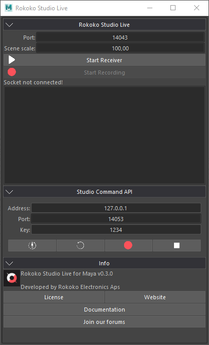

## Installation

* Download the plugin: `link`
* In Maya go to Windows -> Settings/Preferences -> Plug-in Manager
    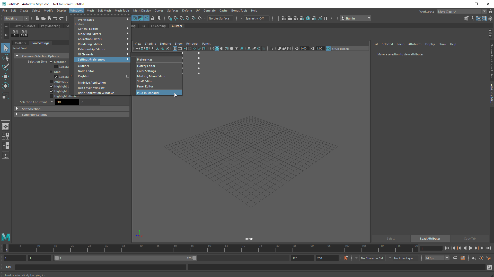
* Browse downloaded mll
    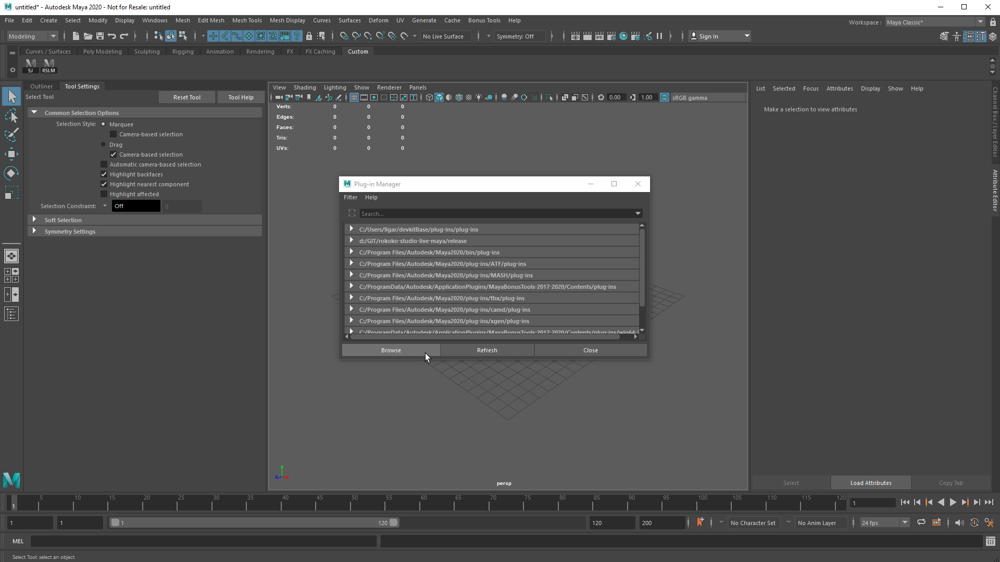
* And enable it
    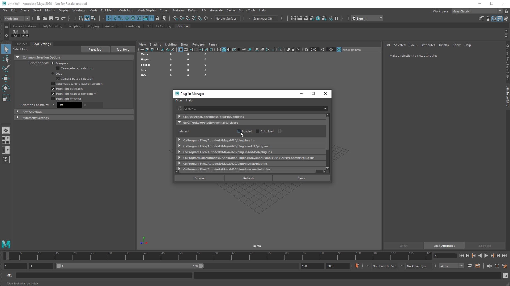
* Go to script editor (Windows -> General Editors -> Script Editor)
and type `showRSLM` command
    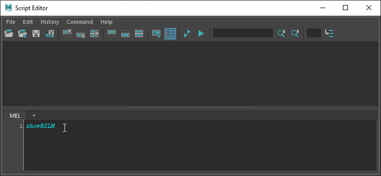
* Select command text and middle click drag it onto the shelf
    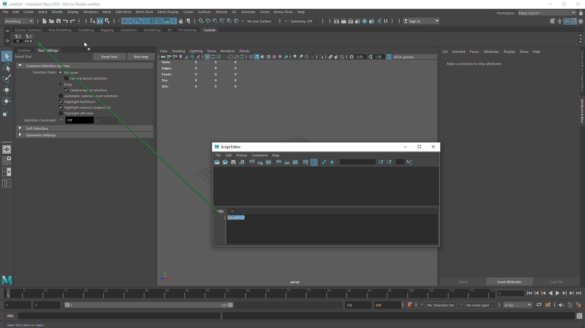

## Plugin anatomy

Plugin's UI consists of 3 collapsible categories.

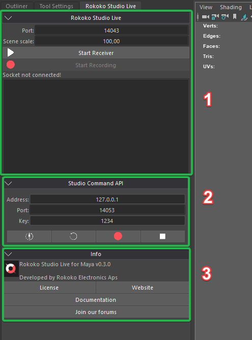

1. **Rokoko Studio Live** - Is the main category where user will see studio contents, map/unmap entities.
2. **Studio Command API** - Functionalities for calibrating and recording in Rokoko Studio. See [detailed description](https://rokokoelectronics.github.io/studio-command-api-docs/) here.
3. **Info** - Links to documentation and tutorials.

# Usage

First of all, make sure Rokoko Studio is running and live streaming **Custom** option is enabled.
Select `JSON v2` or `JSON v3` as data format and `UDP` as protocol. Leave `Port` and `Forward IP` values by default.
Alternatively you can just enable **Maya** option.
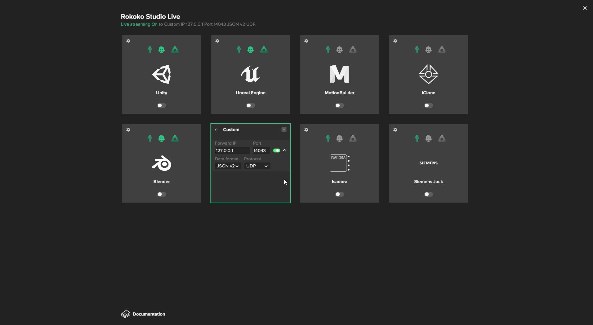

Than go to Maya and hit `Start Receiver` button.
You will see received objects below in a tree structure that resembles scene overview in Studio.
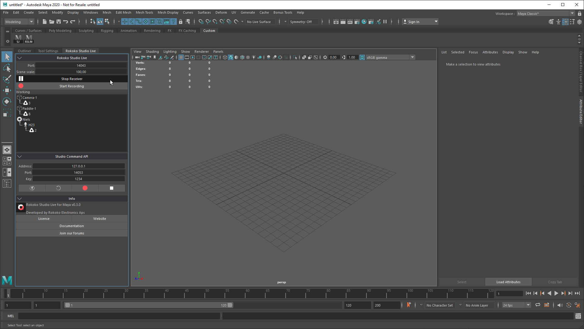

## General workflow idea
All interactions between studio objects and maya objects are made by context menus. User selects
something in maya and this selection will be considered by context menu actions.
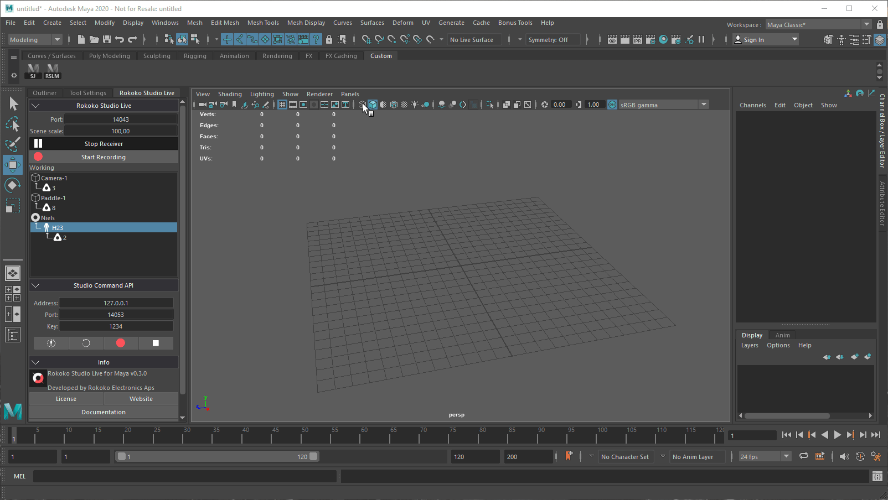

## Streaming virtual production data

### Start streaming (Map objects)

After starting the receiver, select the object in maya viewport that
you want to associate with studio object. Right click on studio object in tree view
and select `Map to selected objects` entry.
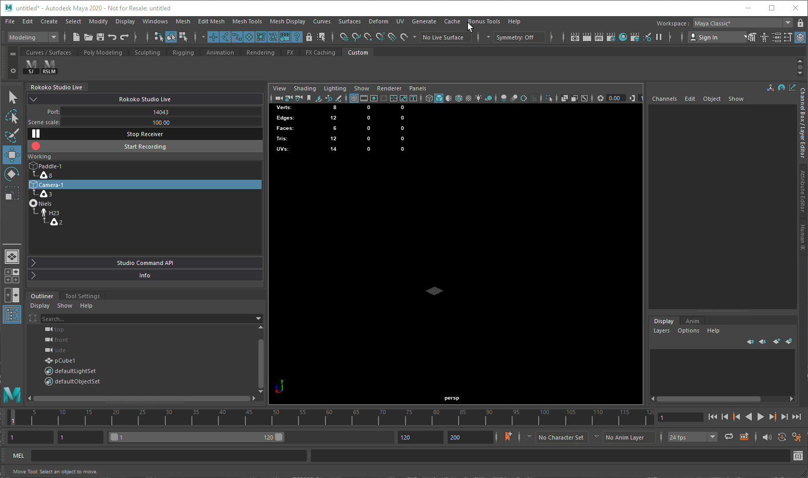

### Stop streaming (Unmap objects)
Right click on studio object in tree view and
select `Unmap selected objects` or `Unmap all` option.
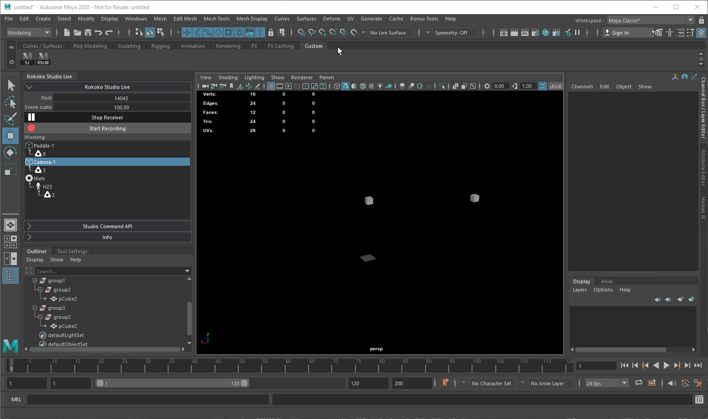

> **NOTE**: Same valid for tracker objects (  )

> **HINT**: Transformations applied to all 6 channels including scale. You may want to scale or offset your maya object, just put it into a group and map this group
instead.

## Streaming character data

After starting the receiver, right click on character studio object in tree view
and select `Create HIK skeleton`. Once new skeleton created select, right click character again
and select `Map to active character`. Currently active character in HIK panel will be mapped.

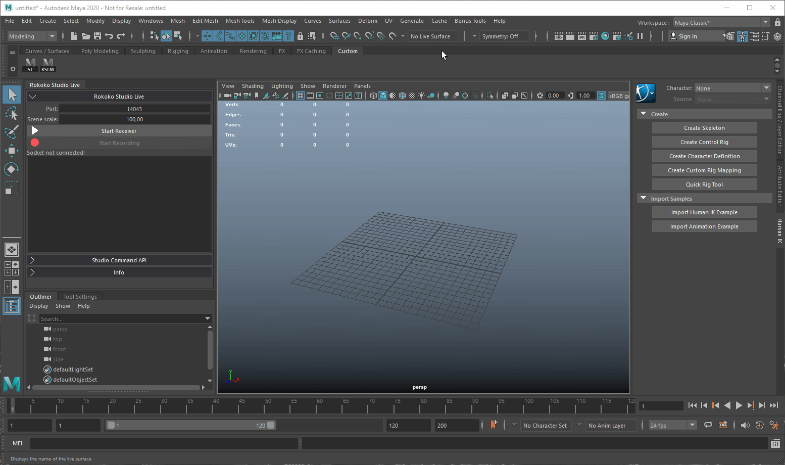

> **NOTE**: In order to map your custom character, you must define it in HIK panel,
and set studio mapped character as source.

## Streaming face data

After starting the receiver, select geometry in maya viewport that hosts face blend shapes, right click on face studio object in tree view
and select `Map to selected objects`. After face geometry is mapped you need to map weight names, to do
that right click face studio object again and select `Automap weights`.
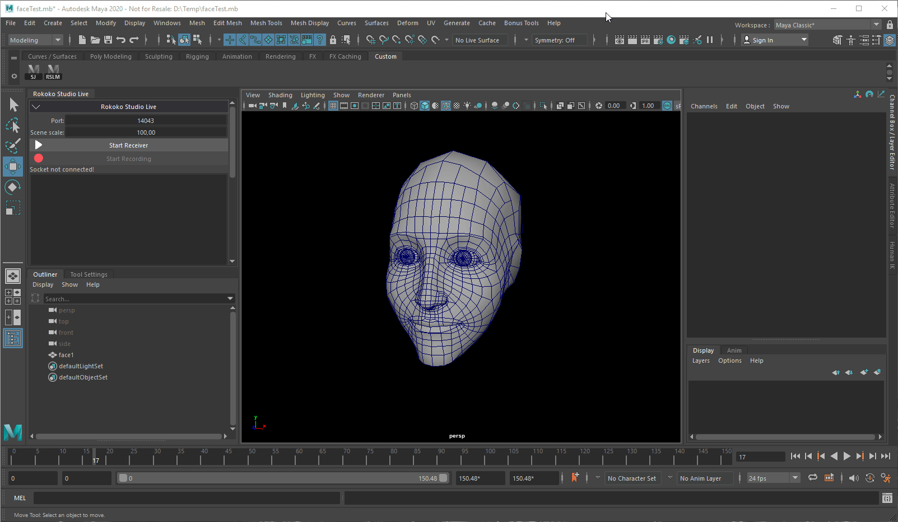

# Recording
To record objects, hit `Start Recording` button. All mapped objects will be recorded into keyframes.

> **NOTE**: Maya's current frame will be considered. Recorded frame range displayed in the right side of record button.
> If you make new recording on top of previous, keyframes will be updated.

# How mapping works

General approach used to map objects are maya's custom attributes. Custom attributes
is native thing and they are saved with maya scenes. Which means that our mapping information
will be preserved across maya sessions.

For each object we create slightly different attributes.

## Props and trackers

In case of props and trackers we just add a single field with identifier.
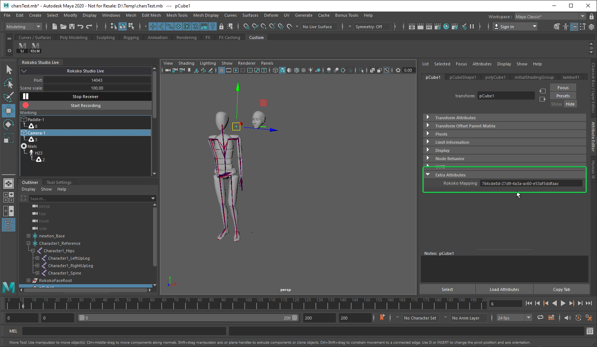

## Characters
In case of characters we map skeleton root bone (Hip). The rest of the bones will
be automatically detected during animation.
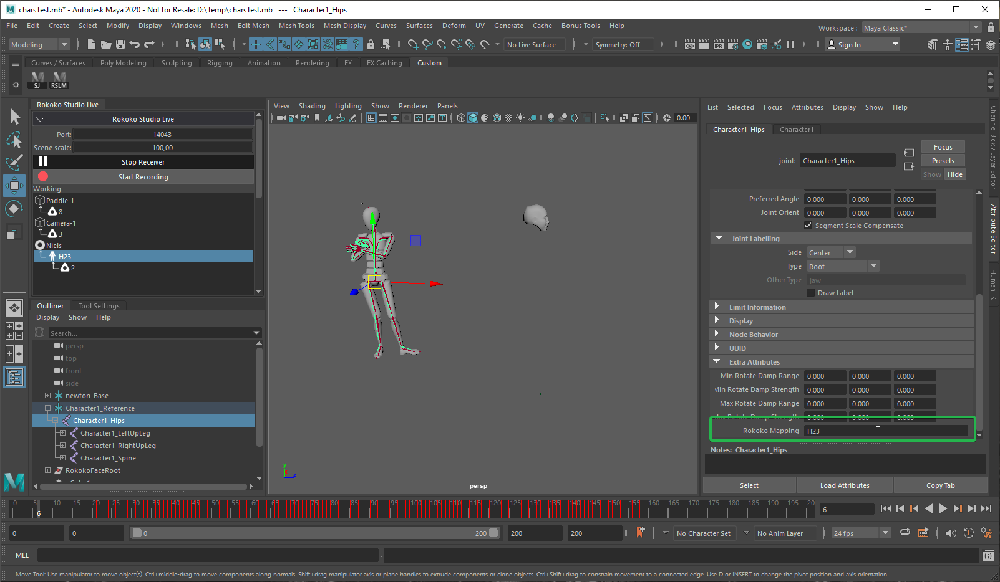
> **WARN**: Do not try to map custom skeletons. Plugin able to work only with hik generated skeletons

## Faces
In case of faces we map blendshape nodes that connected to geometry. Custom compound attribute
will be added to each node. Besides face ID, we add 53 extra fields for each studio face shape.
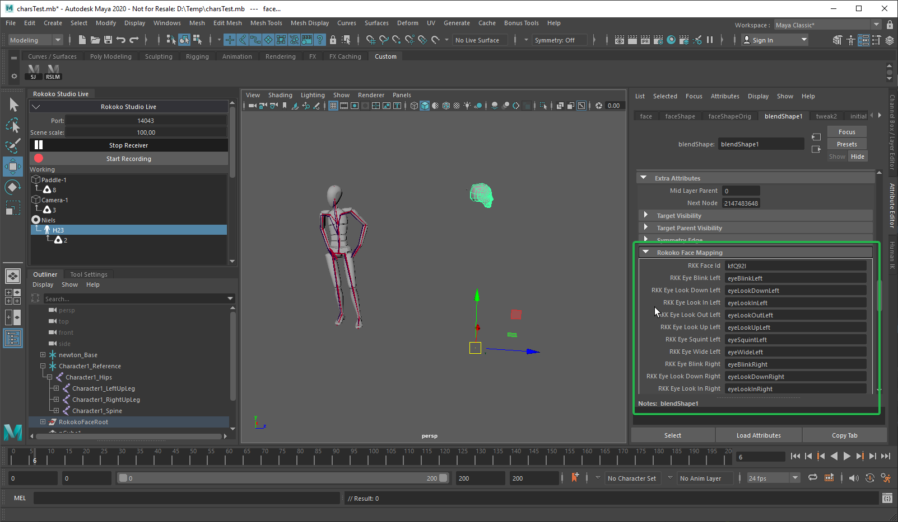
This fields used to map blendshape's existing weight names.
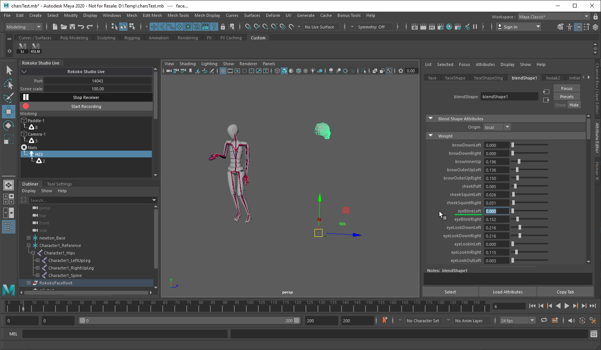
